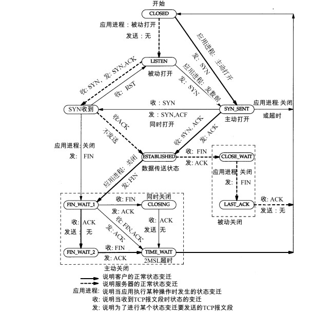
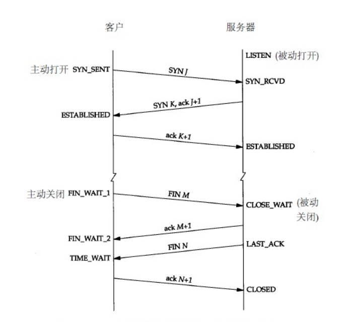
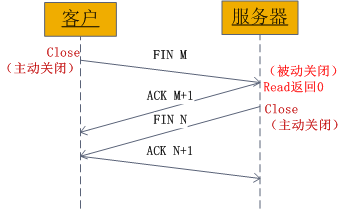

# TCP/IP

## TCP状态转换图

## 建立连接(三次握手)

- 客户端发送一个带SYN标志的TCP报文到服务器(报文1)
- 服务器端回应客户端(报文2), 这个报文同时带ACK标志和SYN标志. 因此, 它表示对刚才客户端SYN报文的回应, 同时又发送标志SYN给客户端, 询问客户端是否准备好进行数据通讯
- 客户端必须再次回应服务端一个ACK报文(报文3)

## 终止连接(四次握手)

由于TCP连接是全双工的, 因此每个方向都必须单独进行关闭. 当一方完成它的数据发送后发送一个FIN来终止这个方向的连接, 另一端收到FIN后, 仍可以发送数据. 首先进行关闭的一方执行主动关闭, 另一方执行被动关闭.

- TCP客户端发送一个FIN, 用来关闭客户端到服务端的数据传送
- 服务端收到FIN, 发回一个ACK, 确认序号为收到的序号加一. 和SYN一样, 一个FIN占用一个序号
- 服务端关闭客户端的连接, 发送一个FIN给客户端
- 客户端发回ACK报文确认, 并将确认序号设置为收到的序号加一

## 状态

| 状态            | 说明                                    | 备注                                       |
| ------------- | ------------------------------------- | ---------------------------------------- |
| `CLOSED`      | 初始状态                                  |                                          |
| `LISTEN`      | 监听状态, 可以接受连接                          |                                          |
| `SYN_RCVD`    | 接受到`SYN`报文                            | 正常情况下, 这个状态是服务端的SOCKET在建立TCP连接时的三次握手会话过程中的一个中间状态. 在这种状态时, 当收到客户端的ACK报文后, 会进入ESTABLISHED状态 |
| `SYN_SEND`    | 客户端已发送SYN报文                           | 与`SYN_RCVD`呼应, 当客户端SOCKET执行CONNECT连接时, 首先发送SYN报文, 随即进入SYN_SEND状态, 并等待服务端发送三次握手中的第二个报文 |
| `ESTABLISHED` | 连接已建立                                 |                                          |
| `FIN_WAIT_1`  | 等待对方FIN报文                             | FIN\_WAIT\_1和FIN\_WAIT\_2都表示等待FIN报文. FIN\_WAIT\_1状态实际上是当SOCKET在ESTABLISHED状态时，它想主动关闭连接，向对方发送了FIN报文，此时该SOCKET进入到FIN\_WAIT\_1状态, 而当对方回应ACK报文后，则进入到FIN_WAIT_2状态. |
| `FIN_WAIT_2`  | 等待对方FIN报文                             | FIN_WAIT_2状态下的SOCKET，表示半连接，也即有一方要求close连接，但另外还告诉对方，我暂时还有点数据需要传送给你，稍后再关闭连接 |
| `TIME_WAIT`   | 收到对方FIN报文, 并发送了ACK报文                  | 等2MSL后即可回到CLOSED可用状态了。如果FIN\_WAIT\_1状态下，收到了对方同时带 FIN标志和ACK标志的报文时，可以直接进入到TIME\_WAIT状态，而无须经过FIN\_WAIT\_2状态 |
| `CLOSING`     | 表示发送FIN报文后, 没有收到对方的ACK报文, 却收到了对方FIN报文 | 如果双方几乎在同时close一个SOCKET的话，那么就出现了双方同时发送FIN报 文的情况，也即会出现CLOSING状态，表示双方都正在关闭SOCKET连接 |
| `CLOSE_WAIT`  | 等待关闭                                  | 收到对方FIN报文, 并回应了ACK报文, 进入到CLOSE_WAIT状态.  在CLOSE_WAIT状态下，需要完成的事情是等待关闭连接. |
| `LAST_ACK`    | 被动关闭一方在发送FIN报文后, 等待对方的ACK报文           | 当收到ACK报文后, 进入CLOSED状态                    |

## 其他

- ACK: 应答作用
- SYN: 同步作用