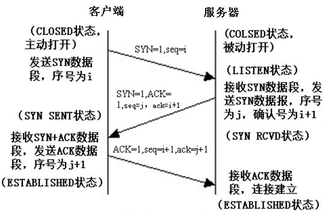

# TCP/IP

## TCP状态转换图

## 建立连接(三次握手)

- 客户端发送一个带SYN标志的TCP报文到服务器(报文1)
- 服务器端回应客户端(报文2), 这个报文同时带ACK标志和SYN标志. 因此, 它表示对刚才客户端SYN报文的回应, 同时又发送标志SYN给客户端, 询问客户端是否准备好进行数据通讯
- 客户端必须再次回应服务端一个ACK报文(报文3)

## 终止连接(四次握手)

由于TCP连接是全双工的, 因此每个方向都必须单独进行关闭. 当一方完成它的数据发送后发送一个FIN来终止这个方向的连接.

- ​