# Matlab 2016b 破解

-   从[百度网盘](http://pan.baidu.com/s/1o86igw6)下载破解文件

    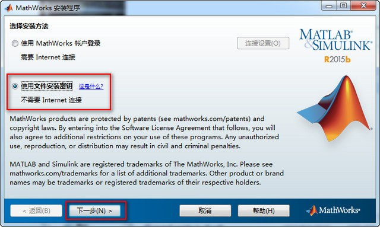

-   虚拟光驱加载或解压ios文件得到“R2016b_win64”文件夹并运行“setup.exe”开始安装，选择“不使用internet安装”下一步；

-   选择“是”接受许可协议；

-   选择我已有我的许可证的文件安装密钥并输入“09806-07443-53955-64350-21751-41297”，点击下一步

    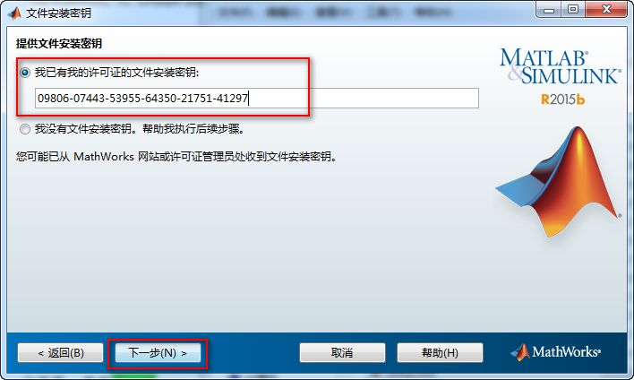

-   安装路径，一般情况下不要安装在C盘，该软件占用空间比较大，至少11G，选择一个非系统盘进行安装，第七软件小编更改为D:\Program Files (x86)并下一步；

    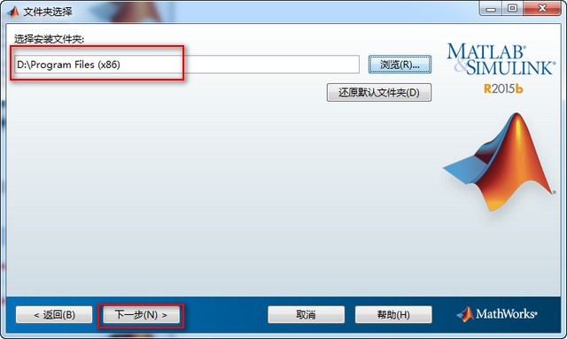

-   选择安装的产品, 不需要全部选择（不想要太多功能可以去掉不需要的即可）并下一步；

    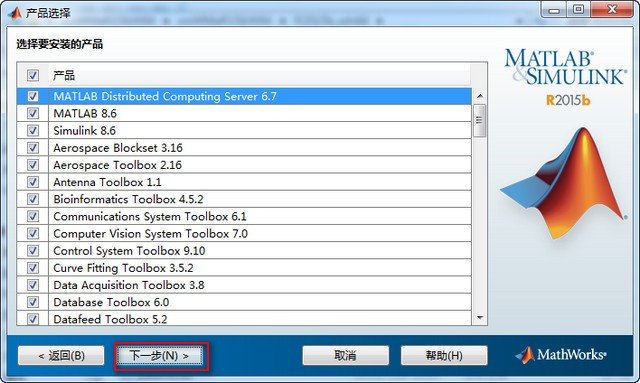

-   快捷方式，全选并下一步；

    

-   确定安装；

    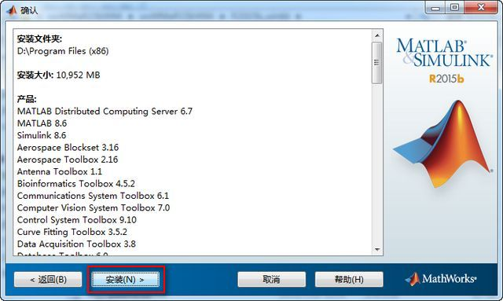

-   正在安装，安装时间根据机器配置不同而不同，我的电脑I7+固态硬盘，大概10多分钟就装好了；

    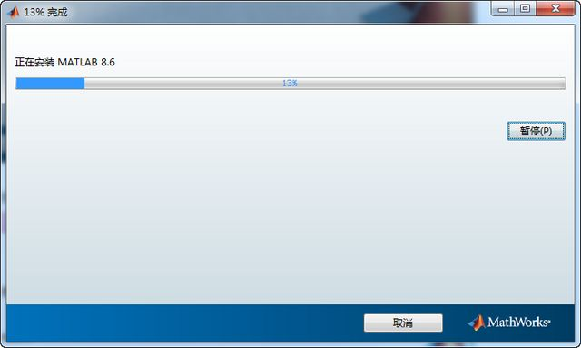

-   安装完成，弹出产品配置说明并下一步；

    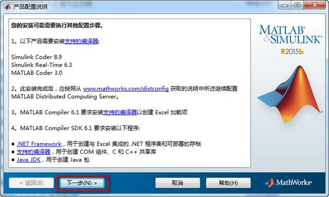

-   安装完成；

    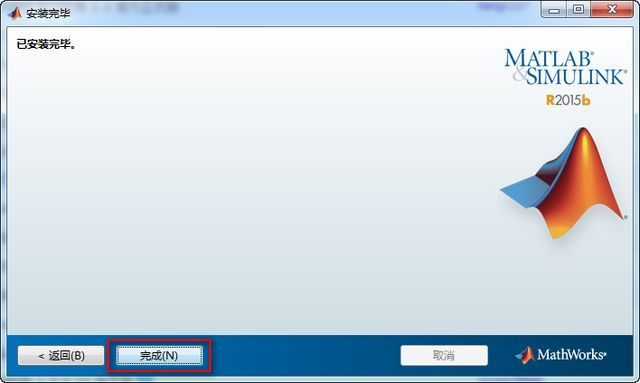

-   安装完成后打开软件目录D:\Program Files (x86)\bin\win64点击“activate_matlab.exe”进行激活，选择“在不选择Internet情况下手动激活”。

    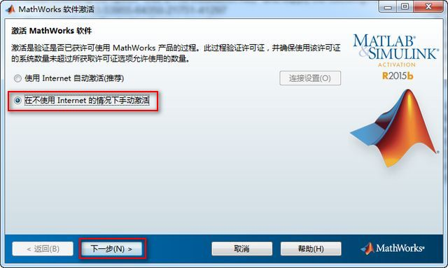

-   点击下一步，浏览找到解压后的“crack”文件夹下的“license_standalone.lic”文件。点击下一步，完成激活。

    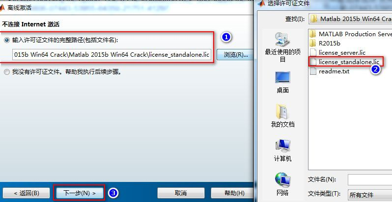

-   如图：成功完成激活

    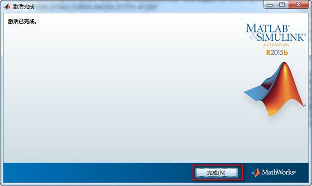

-   “crack”文件夹下面MATLAB Production Server里面的win64文件夹里四个破解动态库文件复制替换 到MATLAB 2016a 安装目录下面的“D:\Program Files (x86)\bin\win64”文件覆盖即可完成破解。

-   打开软件，你已经拥有一个无限制完全免费的matlab 2016b中文破解版本。