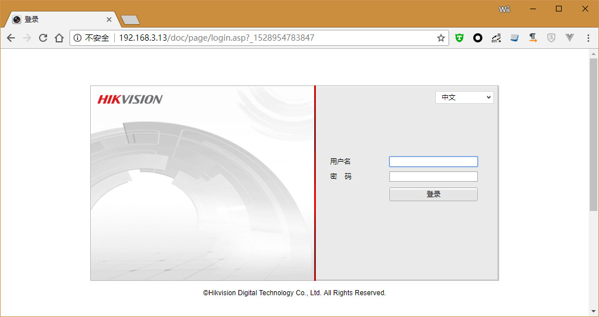
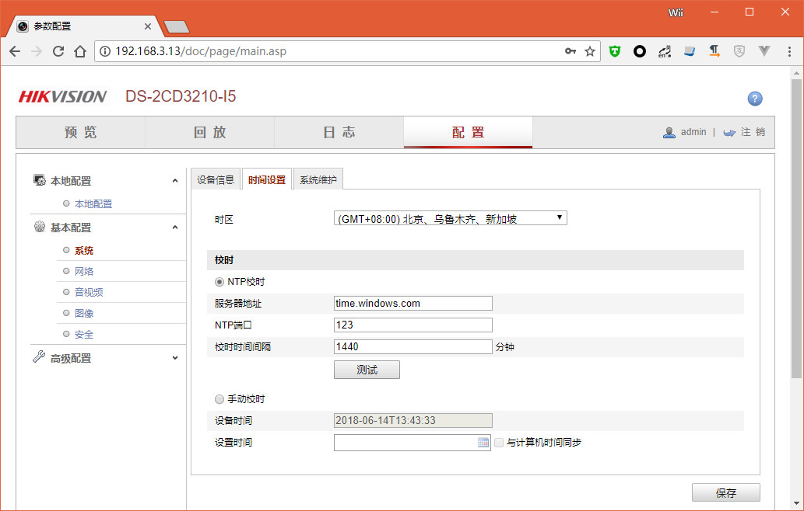
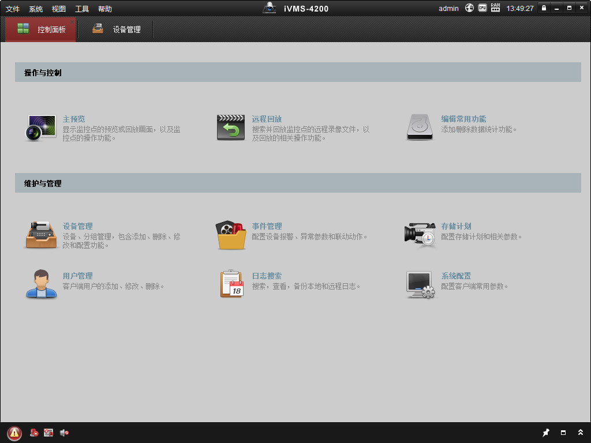
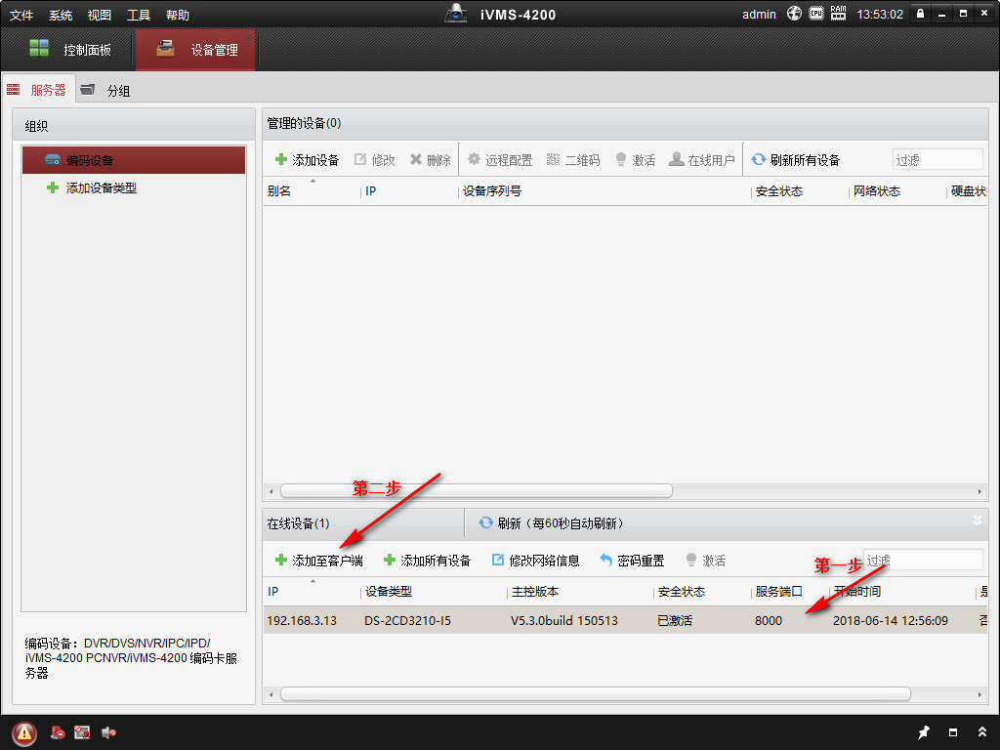
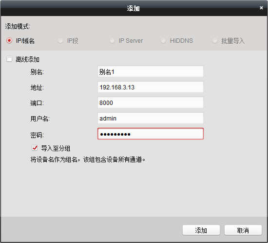
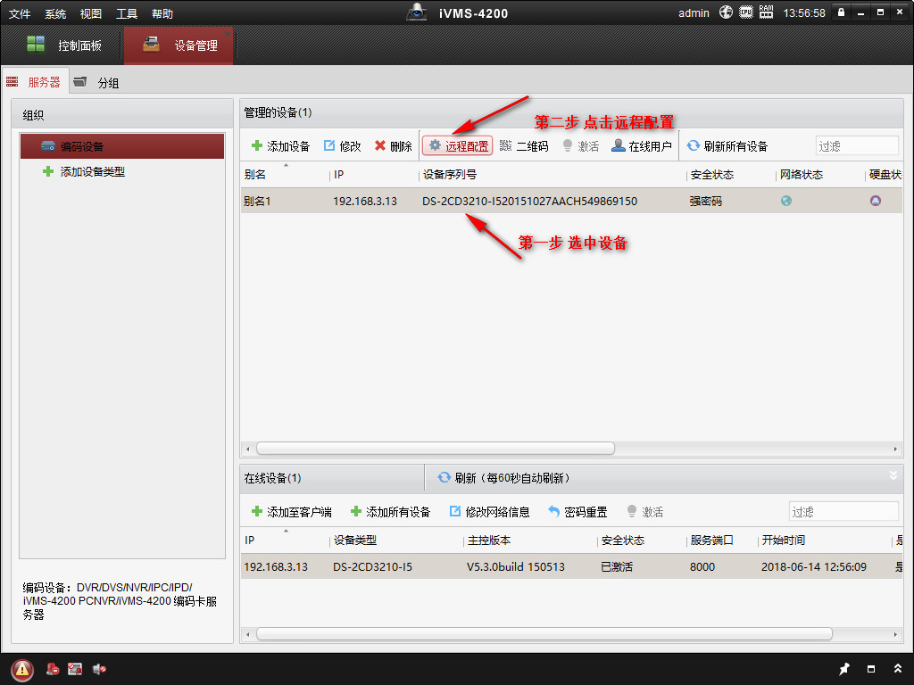
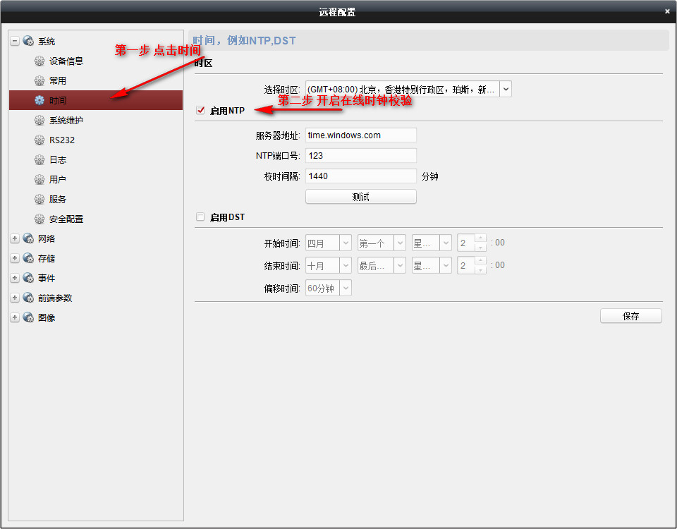

# 通过浏览器访问摄像机进行设置

- 获取摄像机地址

  - 查看路由器终端等方法

- 在浏览器中输入摄像机IP地址（电脑可以访问摄像机）

  

- 输入用户名密码登陆

- 打开菜单：配置 -> 时间设置

- 可以手动校时，也可以通过网络获取时间

  

# 通过海康威视配置工具配置

- 下载配置工具 [iVMS](http://download.hikvision.com/UploadFile//Soft/iVMS-4200(v2.5.0.5-%E7%AE%80%E5%8C%96%E7%89%88).rar)

- 解压安装

- 打开工具

  

- 选择**维护与管理** - > **设备管理**

- 在**在线设备**列表中选择责备，并选择**添加至客户端**

  

- 输入别名、摄像机用户名、密码

  

- 添加完成后，在**管理的设备**中，选中设备，点击远程配置

  

- 在弹出的配置框中选择**时间**菜单，打开在线时钟校对

  