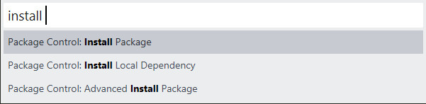
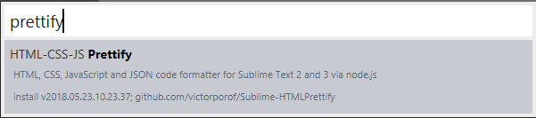
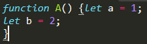
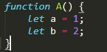
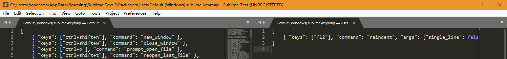
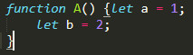
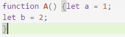
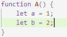

# 格式化代码

## 安装插件

- 打开`Sublime Text 3`

- `Ctrl + Shift + P`

- 输入`install`，选（点击）`Package Control: Install Package`

  

- 输入`prettify`，选（点击）`HTML-CSS-JS Prettify`

  

- 格式化代码快捷键`Ctrl + Shift + H`

**示例**

Format前



Format后



## 不安装插件

仅支持自动缩进。

- 打开`Sublime Text 3`

- 菜单栏 `Preferences -> Key Bindings`

- 右侧用户配置文件添加下面代码

  ```javascript
  [
  	{ "keys": ["f12"], "command": "reindent", "args": {"single_line": false} } 
  ]
  ```

  

- 自动缩进快捷键`F12`

**示例**

缩进前


缩进后



**注** 仅缩进代码

## 使用其他编辑器

### Visual Studio Code

- 快捷键`Ctrl+K Ctrl+F`

### 示例

格式化前



格式化后

