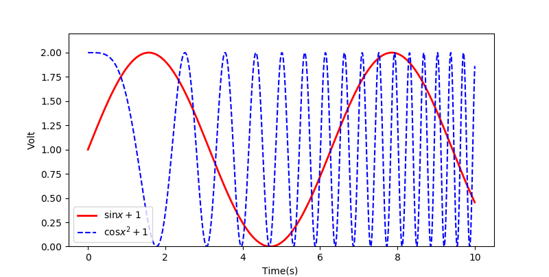
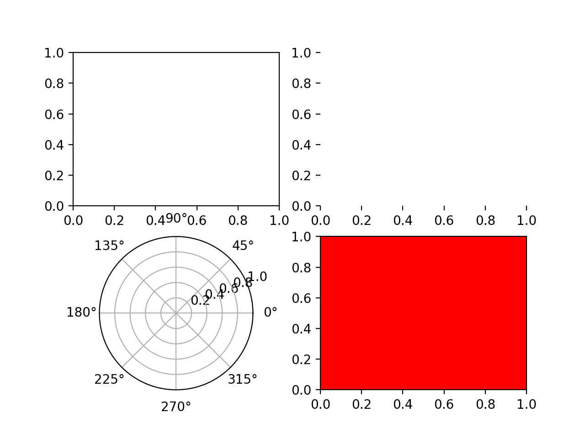
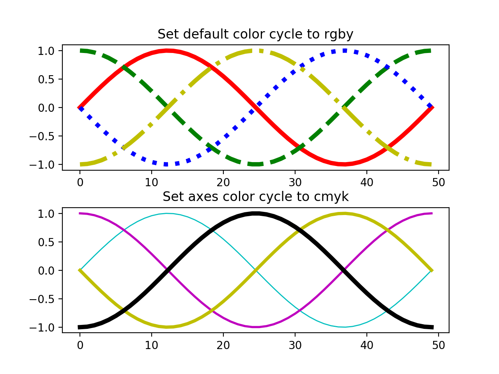

# 简介

Matplotlib

- 数据可视化

# 安装

```shell
sudo pip3 install matplotlib
# or
sudo apt install python3-matplotlib
```

# 示例程序

## sample 1

```python
import numpy as np
import matplotlib.pyplot as plt


x = np.linspace(0, 10, 1000)    # 作图的变量自变量
y = np.sin(x) + 1               # 因变量y
z = np.cos(x**2) + 1            # 因变量z

plt.figure(figsize=(8, 4))      # 设置图像大小
plt.plot(x, y, label='$\sin x+1$', color='red', linewidth=2)    # 作图, 设置标签, 线条颜色, 线条大小
plt.plot(x, z, 'b--', label='$\cos x^2+1$')
plt.xlabel('Time(s) ')  # x轴名称
plt.ylabel('Volt')      # y轴名称
plt.ylim(0, 2.2)        # 显示的y轴范围
plt.legend()            # 显示图例
plt.show()              # 显示作图结果
```

**运行结果**



## Sample 2 - subplot

```python3
#!/bin/python
import matplotlib.pyplot as plt

# add a subplot
ax1=plt.subplot(2, 2, 1)
# add a subplot with no frame
ax2=plt.subplot(2, 2, 2, frameon=False)
# add a polar subplot
plt.subplot(2, 2, 3, projection='polar')
# add a red subplot that shares the x-axis with ax1
plt.subplot(2, 2, 4, sharex=ax1, facecolor='red')

#delete ax2 from the figure
plt.delaxes(ax2)
#add ax2 to the figure again
plt.subplot(ax2)

plt.show()
```



## Sample 3 - drow 

```python
"""
===================
Styling with cycler
===================

Demo of custom property-cycle settings to control colors and other style
properties for multi-line plots.

This example demonstrates two different APIs:

    1. Setting the default rc parameter specifying the property cycle.
       This affects all subsequent axes (but not axes already created).
    2. Setting the property cycle for a single pair of axes.
"""
from cycler import cycler
import numpy as np
import matplotlib.pyplot as plt


x = np.linspace(0, 2 * np.pi)
offsets = np.linspace(0, 2*np.pi, 4, endpoint=False)
# Create array with shifted-sine curve along each column
yy = np.transpose([np.sin(x + phi) for phi in offsets])

# 1. Setting prop cycle on default rc parameter
plt.rc('lines', linewidth=4)
plt.rc('axes', prop_cycle=(cycler('color', ['r', 'g', 'b', 'y']) +
                           cycler('linestyle', ['-', '--', ':', '-.'])))
fig, (ax0, ax1) = plt.subplots(nrows=2)
ax0.plot(yy)
ax0.set_title('Set default color cycle to rgby')

# 2. Define prop cycle for single set of axes	color & width
ax1.set_prop_cycle(cycler('color', ['c', 'm', 'y', 'k']) +
                   cycler('lw', [1, 2, 3, 4]))	
ax1.plot(yy)
ax1.set_title('Set axes color cycle to cmyk')

# Tweak spacing between subplots to prevent labels from overlapping
fig.subplots_adjust(hspace=0.3)
plt.show()
```



## Sample 4 - set size && save picture

```python
#### way 1
from matplotlib.pyplot import figure
figure(figsize=(20, 10), dpi=80,)

#### way 2
plt.figure(figsize=(15, 10), dpi=80)
```

