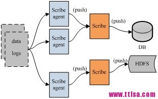
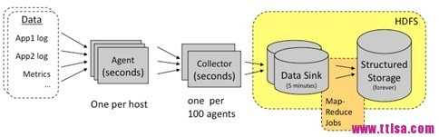
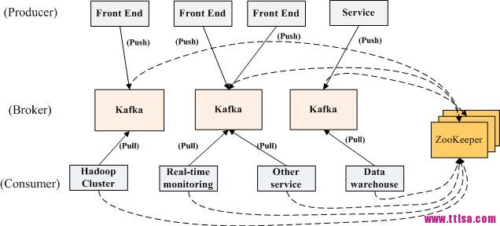
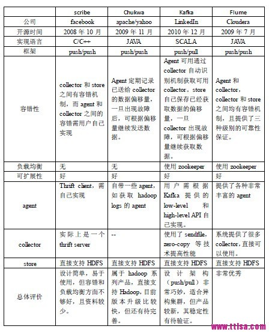

# Data Bus

## 日志收集

- scribe

  

  - 架构（数据流）
    - logs 
    - Scribe Agent
      - thrift client 
      - 作用
        - 接受log数据
        - push到Scribe
    - Scribe 
      - thrift server
      - 作用
        - 接受Scribe Agent数据
        - push 到存储系统
    - DB/HDFS
  - 特点
    - 容错性好，当后端存储崩溃时，会临时存储在本地存储器

- chukwa

  

  - 用HDFS存储，用mapreduce处理数据
  - 架构（数据流）
    - logs
    - Agent
    - Collector
    - HDFS

- Kafka

  

  - 特点
    - 架构新颖（pull/push），适合异构集群
    - 数据在磁盘上的存取代价为O(1)
    - 高吞吐率，在普通的服务器上每秒也能处理几十万条消息
    - 分布式架构，能够对消息分区
    - 支持将数据并行的加载到hadoop
  - 架构
    - 数据流
      - Front End / Service（Producer）
      - Kafka（Broker）
      - Hadoop Cluster / Real-time monitoring / Other Service / Data warehouse（Hadoop Cluster）
    - Kafka是一个发布订阅系统
      - producer向某个topic发布消息（push）
      - consumer订阅某个topic的消息（pull）
      - 有新的关于 某个topic的消息，broker会传递给订阅它的所有consumer
    - 消息管理
      - 组织
        - 按topic组织
        - 每个topic分为多个partition
      - 优点
        - 便于管理数据
        - 进行负载均衡
    - 负载均衡
      - zookeeper进行负载均衡
      - 消息组织方式
    - 角色
      - Producer
        - 任务是向broker发送数据
      - Broker
        - Broker采取了多种策略提高数据处理效率，包括sendfile和zero copy等技术
      - Consumer
        - consumer的作用是将日志信息加载到中央存储系统上

## 日志存储

- hdfs
  - 高容错
  - 高吞吐量
  - 可以流式访问
  - 支持大数据集

# QA

**日志和HDFS**

HDFS的设计初衷是支持大文件存储和小并发高速写的应用场景，而日志系统的特点恰好相反，它需支持高并发低速 率的写和大量小文件的存储。需要注意的是，直接写到HDFS上的小文件是不可见的，直到关闭文件，另外，HDFS不支持文件重新打开。

# 参考

- [scribe、chukwa、kafka、flume日志系统对比](http://www.ttlsa.com/log-system/scribe-chukwa-kafka-flume-log-system-contrast/)