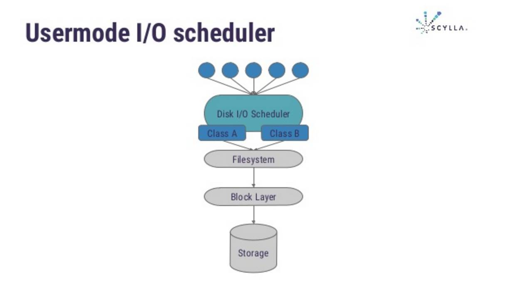

# 简介

**Seastar是支持高并发和低延迟的高性能异步编程库，用于在现代多核机器上编写高效复杂的服务器应用程序。**

由于现代多核和多插槽机器在核心之间共享数据（原子指令，缓存线弹跳和内存防护）有严重的惩罚。Seastar程序使用**无共享编程模型**，即可用内存在核心之间划分每个核心在其自身的内存部分中处理数据，核心之间的通信通过显式消息传递发生（当然，这本身就是使用SMP的共享内存硬件发生的）。 

## **对比现有服务器程序**

对于并发请求，传统的网络服务器处理改善流程：

- 产生一个单独的进程来处理
- 使用进程池
- 使用线程代替进程

每个进程在同一时刻，只处理一个连接。哪怕一个进程阻塞，还会有其他进程来处理其他请求。

对每个连接使用进程（或线程）的服务器进行编程称为同步编程，因为代码是线性编写的，并且一行代码在前一行完成后开始运行。 

> 尽管同步服务器应用程序是以线性，非并行方式编写的，但在后台，内核有助于确保所有内容并行发生，并且机器的资源（CPU，磁盘和网络）得到充分利用。除了进程并行性（我们有多个进程并行处理多个连接）之外，内核甚至可以并行化一个连接的工作 - 例如，处理未完成的磁盘请求（例如，从磁盘文件中读取）与处理并行网络连接（发送缓冲但尚未发送的数据，并缓冲新接收的数据，直到应用程序准备好读取它）。 

启动一个新进程、上下文切换很慢，并且每个进程都带来了很大的开销 - 最明显的是它的堆栈大小。服务器和内核开发者努力减轻这些开销：从进程切换到线程，从创建新线程到线程池，他们降低了每个线程的默认堆栈大小，并增加了虚拟内存大小以允许更多部分利用的堆栈。但是，具有同步设计的服务器的性能并不令人满意，并且随着并发连接数量的增长而严重缩放。 

## 异步编程

编写异步服务器程序面临两大挑战：

- 复杂性
  - 编写一个简单的异步服务器非常简单。但是编写复杂的异步服务器是非常困难的。单个连接的处理，而不是简单易于读取的函数调用，现在涉及大量的小回调函数，以及复杂的状态机，以记住每个事件发生时需要调用哪个函数。
- 非阻塞
  - 每个核心只有一个线程对于服务器应用程序的性能很重要，因为上下文切换很慢。但是，如果每个核心只有一个线程，则事件处理函数必须永远不会阻塞，否则核心将保持空闲状态。但是一些现有的编程语言和框架让服务器作者别无选择，只能使用阻塞函数，因此使用多个线程。 
  - 例如，Cassandra被编写为异步服务器应用程序；但是因为磁盘I / O是用mmap ed文件实现的，这些文件在访问时会无法控制地阻塞整个线程，所以它们被迫每个CPU运行多个线程。 

此外，当需要最佳性能时，服务器应用程序及其编程框架别无选择，只能考虑以下因素： 

- 现代机器
  - 现代机器与10年前的机器截然不同
  - 具有许多内核和深层内存层次结构（从L1缓存到NUMA）
  - 奖励某些编程方式
  - 惩罚一些其他的编程方式
    - 不可扩展的编程方式（例如加锁）可能会破坏许多核处理器的性能
    - 共享内存和无锁同步原语是可用的（即原子操作和内存排序围栏），但是比仅涉及单个内核缓存中的数据的操作要慢得多，并且还阻止应用程序扩展到其他处理器核心
- 编程语言
  - Java，Javascript和类似的“现代”语言等高级语言很方便，但每种语言都有自己的一组假设，这些假设与上面列出的要求相冲突。这些语言旨在实现可移植性，这也使程序员无法控制关键代码的性能。
  - 为了获得真正的最佳性能，我们需要一种编程语言，它为程序员提供完全控制，零运行时间开销，另一方面 - 复杂的编译时代码生成和优化 

Seastar是一个用于编写异步服务器应用程序的框架，旨在解决上述所有四个挑战：

- 它是一个用于编写涉及网络和磁盘I / O的复杂异步应用程序的框架
- 该框架的快速路径完全是单线程（每个核心）
- 可扩展到更多核心
- 最大限度地减少核心之间昂贵的内存共享
- 它是一个C ++ 14库，为用户提供了复杂的编译时功能和完全的性能控制
- 没有运行时开销

## **特点**

- 事件驱动（event-driven）框架
- 可以更简单地编写非阻塞、异步代码
- 基于futures （附录一）
- 使用DPDK作为网络后端（可选）
  - DPDK使用了轮询(polling)而不是中断来处理数据包。在收到数据包时，经DPDK重载的网卡驱动不会通过中断通知CPU，而是直接将数据包存入内存，交付应用层软件通过DPDK提供的接口来直接处理，这样节省了大量的CPU中断时间和内存拷贝时间。
- 使用自己的原生 TCP/IP 栈
  - Seastar附带一个原生、分片的TCP / IP堆栈，通常和DPDK环境一起使用
  - 对于Posix network stack，尽管在Seastar这一层是shar-nothing设计，由于Seastar需要和下方OS network stack进行交互，这样就可能有锁，原子操作，CPU 缓存的miss，性能不可避免地受到损失。所以要想获得最佳性能，推荐配置Seastar native network stack 。

# 特性

- 采用了一套新的编程模式，从而最大化去利用硬件的性能
  - **架构**
    - 完全分片(share-nothing)的设计
      - 每个logic core一个thread
      - 每个logic  core有自己的资源
        - CPU
        - Network
        - Disk I/O
        - Memory
      - 多个core之间没有资源的竞争
      - 随着core数量增加，扩展性和性能也随之提升
    - 多core之间的通讯
      - 采用point-to-point queue发送和接受异步消息
        - 消息队列的两种模式
          - 点对点（point to point, queue）
            - 不可重复消费
            - 生产者发送一条消息到queue，一个queue可以有很多消费者，但是一个消息只能被一个消费者接受，当没有消费者可用时，这个消息会被保存直到有 一个可用的消费者，所以Queue实现了一个可靠的负载均衡
          - 发布/订阅（publish / subscribe, topic）
            - 可以重复消费
            - 发布者发送到topic的消息，只有订阅了topic的订阅者才会收到消息。topic实现了发布和订阅，当你发布一个消息，所有订阅这个topic的服务都能得到这个消息，所以从1到N个订阅者都能得到这个消息的拷贝。
    - core之间没有数据共享
    - 没有锁
    - 没有cache lines频繁的miss
      - 提供独立的存储器给各个core
      - 避免当多个处理器访问同一个存储器产生的性能损失
      - 没有大的堆栈污染缓存
    - 异步编程框架
- 基于Seastar的程序在**每个CPU上运行一个线程** 
  - 默认情况下，Seastar应用程序将接管所有可用内核，每个内核启动一个线程

## 无共享设计

现代硬件工作负载的运行方式与当前编程范例所依赖的硬件明显不同，并且设计了当前的软件基础架构。 

**核心数增加 时钟速度保持稳定**

各个内核的时钟速度性能提升已经停止。核心数量的增加意味着性能取决于跨多个核心的协调，而不再取决于单个核心的吞吐量。在新硬件上，标准工作负载的性能更多地取决于跨核心的锁定和协调，而不是单个核心的性能。软件架构师面临两个没有吸引力的选择：

- 粗粒度锁定，它将看到应用程序线程争夺对数据的控制并等待而不是产生有用的工作
- 细粒度锁定，除了难以编程和调试之外，还看到由于锁定原语本身，即使没有发生争用也会产生显着的开销

**同时 I/O继续提高速度**

现代系统上可用的网络和存储设备的速度也在不断提高。但是，CPU核心处理任何一个核心上的数据包的能力都没有。 


**无共享模型**

并发编程难在共享数据，正是因为共享数据的存在，我们的才需要用各种手段保护它们，才需要在多个核之间同步数据。Seastar会在每个核上创建一个线程，并将此线程绑定在其上。不同核（线程）之间禁共享数据，只能通过消息队列来传递数据。

由于跨核心共享信息需要昂贵的锁定，因此Seastar使用无共享模型将所有请求分片到单个核心。 

Seastar每个核心运行一个应用程序线程，并依赖于显式消息传递，而不是线程之间的共享内存。此设计避免了缓慢、不可扩展的锁定和缓存跳出。 

必须明确处理跨核心的任何资源共享。例如，当两个请求是同一会话的一部分，并且两个CPU各自获得依赖于相同会话状态的请求时，一个CPU必须显式地将请求转发给另一个。CPU可以处理任一响应。Seastar提供限制跨核通信需求的设施，但是当通信不可避免时，它提供高性能的**非阻塞通信原语**，以确保性能不会降低。 

**每个core上运行的线程只处理自己所负责的数据，把异步事件通过Promises的模式调度起来。这样的设计达到了shared-nothing的效果，所以避免了多核之间的锁。**

**核心间通讯**

Seastar为核心之间的通信提供了几个相关的功能。最简单的是： 

```c++
smp::submit_to(cpu, lambda)
```

这是一个承诺。它返回一个future，它是lambda的返回值。它在指定的cpu上运行lambda并返回结果。 

```java
smp::submit_to(neighbor, [key] {
	return local_database[key];
}).then([key, neighbor] (sstring value) {
	print("The value of key %s on shard %d is %s\n", key, neighbor, value);
});
```

线程环境中的等效项需要锁定数据库对象。锁定操作本质上是昂贵的，并且还可以在旋转中强制上下文切换或浪费CPU周期，这取决于所使用的锁定方案。

**跨核通信的其他变体允许向所有CPU广播值，或者向所有CPU发送lambda的map / reduce操作，收集结果，并应用转换以减少到单个值。**

## 高性能网络

Seastar在两个平台上支持四种不同的网络模式，所有这些都没有更改应用程序代码
可以将同一应用程序构建为专用服务器设备或基于内核的VM。

- DPDK networking on Linux：在Linux主机上运行的Seastar应用程序可以直接访问物理网络设备。Seastar应用程序在作为访客，通过设备分配或裸机运行时可以使用DPDK。此模式提供低延迟，高吞吐量的网络。通信不需要系统调用，也不会发生数据复制。这是获得最佳性能的首选。
- Linux standard socket APIs：可以构建Seastar应用程序以使用普通的Linux网络，以便于应用程序开发。 
- Seastar native stack vhost on Linux：将Linux virtio-net设备专用于Seastar应用程序，并绕过Linux网络堆栈。这主要用于开发Seastar TCP / IP堆栈本身。
- Virtio device on OSv：在OSv平台而不是Linux上运行的本机堆栈网络：OSv将虚拟设备分配给Seastar应用程序。 

**可供选择的网络**

Linux中常见的网络功能非常全面，成熟且高性能。但是，对于真正的网络密集型应用程序，Linux堆栈受到限制： 

- **内核空间实现** ：将网络堆栈分离到内核空间，意味着需要昂贵的上下文切换来执行网络操作，并且必须执行数据副本以将数据从内核缓冲区传输到用户缓冲区，反之亦然。
-  **时间共享** ：Linux是一个分时系统，因此必须依靠缓慢、昂贵的中断来通知内核有新的数据包需要处理。 
- **线程模型** ：Linux内核的是高度线程化的，因此所有数据结构都受到锁的保护。虽然巨大的努力使Linux具有很大的可扩展性，但这并非没有限制，并且争用发生在大核心数量上。即使没有争用，锁定原语本身也相对较慢并且影响网络性能。 

通过使用Seastar基本原语实现的用户空间TCP / IP堆栈，可以避免这些约束。**Seastar本地网络享有零拷贝、零锁定和零上下文切换性能。** 

另一种用户空间网络工具包DPDK专为快速数据包处理而设计，通常每个数据包的CPU周期少于80个。它与Linux无缝集成，以利用高性能硬件。

Seastar专为面向未来的开发而设计：可以构建和运行相同的应用程序，以便在部署时最佳工作的网络模式下运行，而不必提前提交经济上不可预测的技术选择。

## Future&Promise

**并行化的范例**

- 跨多个核心协调工作的解决方案很多。有些对程序员非常友好，并且可以开发能够在单核上运行的软件。例如，经典的Unix进程模型旨在使每个进程完全隔离，并依赖内核代码为每个进程维护一个单独的虚拟内存空间。不幸的是，这增加了OS级别的开销。 

**软件开发的挑战** 

- “必须编写程序供人们阅读，并且只能偶然让机器执行。 “硬件已经改变到最初对少量CPU内核进行的假设不再有效的程度。 

- 进程非常独立，但开销很高 

- 线程会给程序员和应用程序基础架构带来额外的协调成本，并且难以调试

- 纯事件驱动编程可能导致难以测试和扩展的代码库

- 一个理想的解决方案：
  - 简单易懂的设计使程序设计和开发易于理解 
  - 现代硬件的最小开销
  - 调试成本低

**解决方案：Seastar futures and promises**

- 这种解决模型被称为“futures and promises”

- Future是一种数据结构，代表一些尚未确定的结果

- Promise是Future的提供者

- 将promise / future对视为先进先出队列有时会有所帮助，其最大长度为一个项目，只能使用一次。Promise是队列的产生结束，而Future是消费结束。像FIFO一样，Future和Promise用于解耦数据生产者和数据消费者。

- 基本Future和Promise在C ++标准库和Boost中实现

- 然而，Seastar对Future和Promise的优化实现是不同的。虽然标准实现针对的是粗粒度任务，可能会阻塞并需要很长时间才能完成，**但Seastar的Future和Promise用于管理细粒度、无阻塞的任务**。为了有效地满足这一要求：

  - 不需要锁定
  - 不分配内存 
  - 支持Continuation

- 示例

  ```c++
  #include "seastar/core/reactor.hh"
  #include "seastar/core/sstring.hh"
  #include "seastar/core/app-template.hh"
  future<sstring>
  compute_something_asynchronously() {
       // pretend some complex computation has taken place
       return make_ready_future<sstring>("world");
  }
  
  int main(int ac, char** av) {
      return app_template().run(ac, av, [] {
  	 compute_something_asynchronously().then([] (sstring who) {
  	      print("hello, %s\n", who);
  	      engine.exit(0);
  	 });
      });
  }
  ```

## 消息传递

说到shared-nothing，没有跨核通讯是不太可能的，对于跨核的通讯，框架中使用了无锁队列来实现。

线程应用程序需要固有且昂贵的锁定操作，而Seastar模型可以完全避免跨CPU通信的锁定。

从程序员的角度来看，Seastar使用Future，Promise和Continuations（f / p / c）。使用epoll和诸如libevent之类的用户空间库的传统事件驱动编程使编写复杂应用程序变得非常困难，f / p / c使得编写复杂的异步代码变得更加容易。

例如，发送方核心C0和接收机核心C1之间的以下交互可以在不需要锁定的情况下进行。

* C0：发送者 - >等待队列进入（通常是立即） - >入队请求，分配Promise。
* C1：出队请求；执行 - >将结果移动到请求对象 - >在响应队列上排队请求
* C0：出队请求；提取响应，用它来兑现承诺；销毁请求。

每个实际队列，一个用于请求，一个用于满足请求的返回队列，是一个简单的指针队列。系统上每对CPU核心有一个请求队列和一个返回队列。由于核心不与自身配对，因此16核系统将具有240个请求队列和240个返回队列。

**从程序员角度来看**

Seastar提供了一组通用的编程结构来管理内核之间的通信。例如：

```c++
return conn->read_exactly(4).then(temporary_buffer<char> buf) {
	int id = buf_to_id(buf);
	return smp::submit_to(other_core, [id] {
		return lookup(id);
	});
}).then([this] (sstring result) {
	return conn->write(result);
});
```

**调试**

并行编程是开发人员技能，随着CPU数量和工作负载并行化的增加而越来越高。虽然有效利用CPU时间是必要的，但对于大多数项目来说，有效使用程序员时间更为重要。Seastar是唯一实现世界级性能和可理解、可测试的框架。 

# Tutorial

## Threads & memory

**线程**

基于Seastar的程序在每个CPU核心上运行一个线程，每一个线程都运行自己的事件循环，在Seastar命名法中称为**引擎**。默认情况下，Seastar应用程序将接管所有可用内核，每个内核启动一个线程。

**内存**

每个线程都预先分配了一大块内存（在它运行的同一个NUMA节点上），并且该线程仅使用该内存进行分配（例如malloc（）或new）。

## Futures & continuations

Futures 和 Continuations 用于构建异步编程块。它们的优势是：

- 轻松地构建大型、复杂的异步程序
- 同时保持代码的可读性和可理解性

Futures通常由异步函数返回。

Continuation是当Future变得可用时的回调函数；通过`then()`附加到Future。

Future编程模型允许程序员封装复杂的异步操作，Seastar引擎负责在适当的时候运行Future的Continuation。

## Ready Future

当Future就绪调用Continuation已经得到优化，不会在事件循环的下一次迭代中注册以便执行。`then()`的实现包含计数器，不会无限制地执行，导致其他Continuation无法执行。

## Continuations

在Seastar中，Continuations是lambda表达式，传递给Future的then方法。lambda对于Seastar的异步编程来说，有一个非重要的特性：Lambdas可以捕获状态。

**Lambdas 不仅仅是一个函数 ，它实际上是一个对象，包含代码和数据**。从本质上讲，编译器会自动为我们创建状态对象，我们既不需要定义它，也不需要跟踪它（当Continuations需要延期执行时，它会与Continuations一起保存，并在继续运行后自动删除）。

当一个Continuations捕获状态并立即执行时，不会产生额外运行时开销。但是，让Continuations不能立即执行时（因为Future还没有就绪），需要在堆上为这些数据分配内存，并且需要在那里复制Continuations捕获到的数据。这会有运行时开销，但这是不可避免的，并且与线程编程模型中的相关开销相比小很多（在线程程序中，这种状态通常驻留在被阻塞线程的堆栈上，但堆栈要比Lambda捕获的状态大得多，占用大量内存并导致大量缓存，影响线程之间的上下文切换）。

C++中有两种捕获：

- 通过引用捕获
- 通过移动捕获

使用引用捕获通常会出错，因为如果很久才能执行Continuations，那么捕获的引用可能变为不相关的内容。但是可以使用`do_with()`来解决这个问题，确保一个对象在Continuations的整个生命周期存在，使得引用捕获成为可能。

使用移动捕获也很有用，通过将对象移动到Continuations，将此对象的所有权转移到Continuations，使得Continuations结束时自动删除对象变得容易。

## Handling exceptions

处理异常的原语：

- `.then_wrapped()`
- `.finnaly()`

## Lifetime management

异步函数执行一个操作，该操作可能在函数返回后很长时间内继续：函数本身几乎立即返回一个Future，但可能需要一段时间才能完成Future的计算。

当这样的异步操作需要对现有对象进行操作或使用临时对象时，我们需要担心这些对象的生命周期：确保在异步函数完成之前不会销毁这些对象（否则会尝试使用释放的对象，导致故障或崩溃），并确保对象最终在不再需要时被销毁（否则会内存泄漏）。

Seastar提供各种机制，可以在适当的时间内安全有效地保持对象的存活。

### Passing ownership to continuation

将所有权转移到Continuation。

在Continuation运行并且之后被销毁时，确保对象处于活动状态的最直接的方法是将其所有权传递给Continuation。当Continuation拥有该对象时，在运行时该对象将被保留，并且一旦不需要，就会被销毁。

### Keeping ownership at the caller

一种更简单的方法是让异步函数的调用者继续成为对象的所有者，并将对象的引用传递给需要该对象的其他异步函数和Continuations。

### Sharing ownership (reference counting)

将对象的副本捕获到一个Continuation里面虽然很简单，但是对于复杂的对象，复制通常代价很大，甚至有些对象无法复制。这些问题的解决方案就是引用计数。

### Saving objects on the stack

把对象保存在堆栈。

# Seastar基石

## 架构

Seastar借助以下概念，实现极致性能：

- 协同微任务调度程序 （Cooperative micro-task scheduler）
  - 每个核心运行一个协同微任务调度程序，而不是运行线程
  - 每个任务通常都非常轻量级 - 只运行处理最后一个I / O操作的结果并提交一个新任务
- 无共享SMP架构 （Share-nothing SMP architecture）
  - 每个核心独立于SMP系统中的其他核心运行。内存，数据结构和CPU时间不共享；相反，核心间通信使用显式消息传递。Seastar核心通常被称为分片。
- 基于Future的APIs（Future based APIs）
  - future允许提交 I/O 操作并在完成 I/O 操作时链接要执行的任务。并行运行多个 I/O操作很容易 - 例如，为了响应来自TCP连接的请求，您可以发出多个磁盘I / O请求，将消息发送到同一系统上的其他核心，或发送请求到群集中的其他节点，等待部分或全部结果完成，聚合结果并发送响应。 
- 无共享TCP堆栈 （Share-nothing TCP stack）
  - 虽然Seastar可以使用主机操作系统的TCP堆栈，但它还提供了自己的高性能TCP / IP堆栈，它建立在任务调度程序和无共享架构之上。堆栈在两个方向上提供零拷贝：可以直接从TCP堆栈的缓冲区处理数据，并将自己的数据结构的内容作为消息的一部分发送，而不会产生副本。 
- 基于DMA的存储APIs（DMA-based storage APIs）
  - 与网络堆栈一样，Seastar提供零拷贝存储API，允许将数据与存储设备进行DMA数据交换。

## 异步

- Future
- Promise
- Continuation
  - 代表一段计算，最常用的就是Lambda函数
  - Continuation通过future的then函数绑定到future上 
  - then函数的输入参数就是绑定的future对象 
  - 当future 的值available时，这些绑定的continuations就会自动执行 
- 高阶接口
  - Seastar在f-p-c基础上还实现了更高级的接口：
    - 异步操作的并行执行parallel_for_each 
    - 异步操作的循环执行repeat 
    - 同步等待异步操作的执行when_all 
    - 对于map reduce支持 
    - Semaphore，gate和pipe等接口

## 并行

并行的标准方法是使用线程。然而，该模型具有许多性能缺陷，因此Seastar使用不同的模型。Seastar使用**分片或分区**来管理多个核心。**每个核心都分配了机器上的连接和数据的子集 ，每个核心和其他核心一起对所有的连接和数据共享处理任务**。如果核心上的计算需要访问驻留在另一个核心上的数据，则它必须显式向远程核心发送消息，要求它读取或写入数据，并等待结果。 

线程和进程是操作系统提供的抽象。操作系统不是拥有一个或少量固定数量的处理器，而是允许用户根据自己的喜好创建尽可能多的虚拟处理器，并在物理处理器之上复用这些虚拟处理器。这些虚拟处理器称为线程（如果它们彼此共享内存）或进程（如果它们不共享）。

最简单的线程方法是每个连接线程。对于需要提供的每个连接，都会创建一个线程，在该线程中运行读取进程响应循环。这种方法存在许多问题，将其局限于最简单的应用程序： 

- 通过大量连接，可以创建许多线程。线程是重量级对象，因此分配其中许多对象会消耗资源（主要是内存）。 
- 如果许多连接同时处于活动状态，则许多线程将同时运行。操作系统将被迫在线程之间快速切换;因为这是一项昂贵的操作，性能会下降。 
- 很难保证及时处理事件。如果系统有太多线程，它们可能都很忙，系统可能无法及时安排为我们的事件服务的线程。如果线程太少，它们可能都会被I / O阻塞，因此即使处理器资源可用，系统也可能无法满足我们的要求。获得正确数量的线程是一个难题。

因此，大多数线程应用程序现在都使用线程池。这里，大量连接被复用在较少数量的线程之上（它们本身在多个处理器的顶部被复用）。读取线程将等待连接变为活动状态，将其分配给线程池中的空闲线程，然后线程池将读取请求，处理请求并进行响应。

但是，这些线程设计仍存在性能问题： 

- 需要锁定连接之间共享的数据。在最坏的情况下，锁会导致过多的上下文切换和停顿。在最好的情况下，它们是昂贵的操作，并且在具有十几个或更多核心的大型机器上不能很好地扩展。 
- 将从多个核心上的线程访问共享可写数据。这要求处理器将数据从一个处理器的缓存移动到另一个处理器缓存，这是一个缓慢的操作。 
- 在一个处理器上分配的数据可以在另一个处理器上访问，或者在另一处使用NUMA架构，这会严重损害内存访问时间，并减慢内存分配器的速度。 

**分区化的网络连接**

为了对连接进行分区，seastar会自动划分核心之间的连接。它利用现代网络接口卡（NIC）的能力，为每个核心提供数据包队列，并自动将数据包子集转移到这些队列。这样，每个Seastar核心接收所有连接的共享，并且属于那些连接的所有分组由该核心处理。 

**分区化的数据**

Seastar无法自动分区数据。用户必须选择分区方法并将处理转移到正确的核心。一些分区策略包括： 

- 散列密钥：例如，键值对类型存储可以使用密钥的低位来选择核心。当您拥有通常使用主键访问的大量对象时，这是合适的
- 复制：data在所有核心上进行复制。读取由本地核心提供，而修改则广播到所有核心。该策略对于频繁读取的数据很有用，很少写入且容量是小到中等的数据

一类应用程序特别适合分区 - 横向扩展服务器类。这些已经跨节点分区，因此核心之间的分区仅使用节点内部分片扩展模型。

对网络和数据进行分区化的好处：

- 位置：核心始终访问在同一核心上分配和操作的数据。这对内存分配器，CPU缓存和NUMA体系结构都有好处
- 锁：对锁的需求大大减少 - 通常根本不需要锁定，因为对数据项的所有访问都是隐式序列化的。当需要锁定时（例如，在处理数据时需要I / O时），使用普通处理器指令而不是序列化原子读 - 修改 - 写指令来完成

# 架构

- 基于分片的异步编程框架 
  - 能够实现复杂的服务器逻辑 
  - 保证网络和存储操作、多核之间操作的异步性 
  - 达到**高性能和低延迟**的目标 

- 对比传统数据栈
  - 

- **内存切片（shard）**
  - Seastar运行后会保留（--reserve-memory）小部分内存给操作系统或者预留（-m）一定数量的内存给自己 
  - Seastar对分配给自己的物理内存也进行了分片（shard） 
  - 每个core有
    - 自己的内存空间
    - 自己的memory allocator（log-structured）
      - 对内存区域进行分配和释放管理
      - 无需考虑thread safe和内存碎片化（定期compact，移动object，合并memory holes） 
  - 对比JVM
    - 

- 网络分片
  - 所有的网络连接在cores之间分片（shard） 
  - 每个core只负责处理自己那部分数据连接 

- 用户态task调度
  - 对比传统线程调度
  - 
    - 每个core上都有一个task scheduler，相对于内核中的thread，每个task都是一个轻量级的任务
    - Seastar有两种类型的task
      - Non-threaded context task ：这种task一般很短，没有自己的栈，主要由Lambda函数组成，event-loop 主线程循环调度task队列中的Lambda函数。当然如果这种task不能立即执行，是需要内存空间来保存相应的状态，不过比起thread栈来说，开销很小。 
      - Threaded context task ：这种task的实现实际上就是用户态协程，它们有自己的栈，只会主动让出(yield) CPU，用setjmp/longjmp进行用户态的上下文切换，有相应的调度policy（例如基于时间片的调度去保证公平性）。
  - 所有这些用户态task不能调用blocking系统调用，因为整个core只有一个系统thread。有时候又不得不调用blocking系统调用，那只能另起一个Posixthread。所以大部分时间，整个core只有一个Posix thread在运行，有时候会是两个。 

- 用户态磁盘 I/O 的调度

  - Seastar利用操作系统libaio提供的io_submit去提交磁盘操作和io_getevent来收集操作结果，从而实现磁盘I/O操作的异步性。但Linux对于aio支持的并不是很好，并不是所有文件系统都支持aio,即使有的支持,也有很多问题。 

  - 最新的xfs对于aio支持的很好，所以对于disk IO，只推荐采用xfs。由于在内核中，从文件系统（file system）到块设备层（block level）再到具体的存储设备层，每个层都有I/O队列，对I/O进行了自己的管理。一旦storage I/O出现拥塞，不太容易判断哪层出现问题，也不好采取措施进行调控。 

  - 因此，Seastar在用户态实现了I/O scheduler，对磁盘I/O进行精确的分级控制和调优。Seastar有自己的I/O queue来缓存I/O，并实现了各种I/O priority class，从而保证各种I/O调度的公平性。下图示意了Seastar实现的用户态I/O调度器： 

    

- 用户态原生网络栈（Native network stack）

  - 下图描绘了Seastar的网络栈，即包含Posix stack，也包含原生网络栈：

    

  - 除了支持常规的Posix network stack，Seastar还支持基于DPDK的native network stack。大家知道，DPDK是Intel推出的一个高性能用户态网络管理包，其核心思想和Seastar是一致的：用户态轮询(poll)模式的网卡驱动，没有中断，没有上下文切换，没有内存拷贝，无锁，share-nothing，自己的内存管理，利用NUMA等等。 

  - DPDK主要提供L2数据包处理功能，需要上层应用提供L3及以上的网络管理。Seastar实现了TCP/IP协议：每个core绑定到物理网卡的一个接受队列和发送队列，这样所有的数据连接也被分片（shard），每个core自始至终只负责自己那部分数据连接。对于native network stack，没有syscall调用，没有多余的数据复制，没有锁，性能当然最好。 

## 用户态操作系统

Seastar是一个应用框架，它几乎将操作系统所提供的抽象完整地搬移到了用户态中，以减少操作系统的抽象开销，实现软硬件一体化。

### 执行流抽象

可以将Seastar想象成一个支持多核的操作系统，每个核上运行着许多的执行流。但是与操作系统不同的是，这些执行流有固定的宿主核，每个执行流从头到尾只能在一个核上运行，并且，位于不同核上的执行流之间，只能通过跨核消息来通信。

Seastar将每个核抽象成一台单核计算机，每个单核计算机上运行着许多执行流，一个单核计算机上的多个执行流可以共享数据，不同单核计算机上的执行流只能通过消息来共享数据。

现在考虑Seastar如何提供执行流抽象的。执行流的本质是一系列微任务被链接起来后形成的一个微任务链。为什么是微任务链，而不是一个连续的宏任务？因为，我们的任务通常涉及到IO，而IO并不总是可用的，比如，读一个socket时，其内还没有数据。此时，我们显然需要让出CPU，等待socket可读，才进行接下来的步骤。于是，我们的一个完整的宏任务被拆成了很多微任务，这些微任务被链接起来后，即是我们的宏任务，也即是我们的执行流。


当然，复杂的微任务甚至可以构造一个有向无环图。这个有向无环图会由Seastar抽象的用户态CPU按照拓扑序来调度执行。

那么，Seastar是如何将这些微任务链接起来的？一种简单的方法是回调函数。一种复杂的方法是提供用户态线程的抽象，即所谓协程，给用户提供一个单协程占用整个CPU的抽象。Seastar提供了另一种抽象，FPC，即future-promise-continuation。FPC使得构造有向无环图更加方便，使用协程的话，还需要提供latch/conditional variable等同步原语，才能构造更加复杂的执行流。

Seastar在每个用户态CPU上运行一个调度器，来调度一系列的微任务。

### 内存抽象

Share-nothing的用户态执行流的抽象降低了切换开销以及同步开销，然而，同一进程内，内存是共享的，分配与释放内存时，依然会有同步的存在。为了避免此问题，Seastar在应用启动时，将整个虚拟地址空间按照CPU核数等分为若干块，每个CPU使用自己的内存块进行内存分配与释放，从而避免同步。

### 文件抽象

Seastar是一个异步框架，任何一个核阻塞都会造成核上的待调度的微任务严重超时。然而，令人无奈的是，传统文件系统操作是同步阻塞的。好在AIO的存在解决了这一问题（虽然现在AIO还是一堆坑）。AIO有一些固有的限制，它必须以O_DIRECT方式打开文件，导致不能使用pagecache以及读写必须对齐。为了解决AIO的问题，Seastar维护用户态PageCache，从而实现了Zero copy的文件操作。并且，它维护自己的IO调度策略，从而更好地使用磁盘。

### 用户态网络栈

Seastar支持多种形式的网络操作，一是传统的epoll方式，这种方式已经非常成熟，并且在业内有广泛应用。另一种是用户态网络栈+DPDK，从而实现Zero copy与Zero switch的网络操作，进一步提高了网络的性能。

# 推荐配置

- CPU
  - 按需，很好地支持多核CPU和NUMA
- 网卡
  - 尽可能快
  - 每个CPU的硬件队列越多，SeaStar就越好。否则我们必须在软件中模仿它 

# 应用

Seastar当前专注于高吞吐量，低延迟 I/O 应用：

- Scylla
  - NoSQL数据库
- Seastar HTTPD
  - Web服务器
- Seastar Memcached

# 不足

- 并非所有应用程序都适合分片，这些应用程序根本无法受益
- 由于分区不均匀导致核心之间的不平衡可能导致某些核心过载而其他核心相对空闲，从而浪费资源 

# 附录

## 附录一：Futures and promises

计算机科学中，future、promis、delay、deferred，是指用于在一些并发编程语言中**同步程序执行的方式**。他们描述了一个对象，该对象充当最初未知的结果的代理，通常是因为其值的计算尚未完成。

通常，future、promis、delay、deferred 可以互换使用。future是变量的只读占位符，而promise是可写的单个赋值容器，用于设置future的值。

可以定义 future 而不指定特定的 promise 设置其值。future 和 promise 相互关联：future 是值，promise 是设置值得函数。

future 和 promise 起源于函数式编程，**将值（a future）与其计算方式（a promise）分离**，从而允许更灵活地进行计算，特别是通过并行计算。

常见 Future 比如有：

- 正在从网络读取的数据缓冲区
- 计时器到期
- 磁盘写操作完成
- 计算结果来自一个或多个其他 future 值

**Promise 和 Future 简化了异步编程，因为它们将事件生成器（promise）和事件使用者（使用future的任何人）分离。 不管promise是否在future使用前完成，或者相反，都不会改变代码的输出结果。**

**消费Future**

使用`then()`方法消费一个Future，并提供一个回调函数。

```c++
future<int> get();   // promises an int will be produced eventually
future<> put(int)    // promises to store an int

void f() {
    get().then([] (int value) {
        put(value + 1).then([] {
            std::cout << "value stored successfully\n";
        });
    });
}
```

**链式Future**

`then()`可以返回一个future。

```c++
future<int> get();   // promises an int will be produced eventually
future<> put(int)    // promises to store an int

void f() {
    get().then([] (int value) {
        return put(value + 1);
    }).then([] {
        std::cout << "value stored successfully\n";
    });
}
```

**Loops**

通过尾调用实现循环 

```c++
future<int> get();   // promises an int will be produced eventually
future<> put(int)    // promises to store an int

future<> loop_to(int end) {
    if (value == end) {
        return make_ready_future<>();
    }
    get().then([end] (int value) {
        return put(value + 1);
    }).then([end] {
        return loop_to(end);
    });
}
```

**异常捕获**

如果一个`then()`抛出异常，调度器会捕获异常，并取消所有依赖的`then()`的调用。如果想捕获异常，可以在语句最后添加`.then_wrapped()`。

```c++
future<buffer> receive();
request parse(buffer buf);
future<response> process(request req);
future<> send(response resp);

void f() {
    receive().then([] (buffer buf) {
        return process(parse(std::move(buf));
    }).then([] (response resp) {
        return send(std::move(resp));
    }).then([] {
        f();
    }).then_wrapped([] (auto&& f) {
        try {
            f.get();
        } catch (std::exception& e) {
            // your handler goes here
        }
    });
}
```


## 附录二：DPDK

数据平面开发套件（DPD，Data Plane Development Kit），主要基于Linux系统运行，**用于快速数据包处理的函数库与驱动集合，可以极大提高数据处理性能和吞吐量，提高数据平面应用程序的工作效率**。

DPDK架构通过创建EAL(Environment Abstraction Layer,环境抽象层)来为不同的工作环境创造函数库集，创建后开发者即可把自己的应用与函数库进行链接。

**工作原理**

**DPDK使用了轮询(polling)而不是中断来处理数据包**。在收到数据包时，经DPDK重载的**网卡驱动不会通过中断通知CPU，而是直接将数据包存入内存**，交付应用层软件通过DPDK提供的接口来直接处理，这样节省了大量的CPU中断时间和内存拷贝时间。

**环境抽象层**

DPDK的创造的环境抽象层(EAL, Environment Abstraction Layer)主要负责对计算机底层资源（如硬件和内存空间）的访问，并对提供给用户的接口实施了实现细节的封装。其初始化例程决定了如何分配这些资源（PCI设备、计时器、控制台等）。 

**轮询模式驱动**

DPDK包括1Gb,10Gb,40Gb和半虚拟化抽象层的轮询模式驱动(PMD, Poll Mode Driver)。PMD由用户空间的特定的驱动程序提供的API组成，用于对设备和它们相应的队列进行设置。**抛弃了基于中断的异步信号发送机制为该架构带来很大的开销节省。避免中断性能瓶颈是DPDK提升数据包处理速度的关键之一。**

DPDK环境为数据包处理应用考虑了两种模型：运行至完成(run-to-completion)模型和管道(pipeline)模型。

- 在运行至完成模型中，一个API向某个特定端口的接收描述符环轮询以接收数据包。接着这个数据包在同一个核上被处理，之后被一个发送用API放到端口的传输描述符环上。
- 在管道模型中，一个核心会通过API对一个或多个端口的接收描述符环进行轮询，数据包通过环被接收和传递给另一个核心，然后在这个核心上被处理，之后可能被发送用API放到端口的传输描述符环上。

BEFORE

- 网络数据请求
- 阻塞
- 网卡接受完成数据
- 产生中断
- CPU发送指令拷贝网卡内容至内存

AFTER

**技术**

- 用户态驱动实现zero-copy。如果使用linux内核的协议栈发包，会多一次用户态到内核态的内存数据copy。linux内核已经支持用户态驱动的framework，编写用户态驱动可以减少内存copy

- 传统的linux网卡驱动是基于cpu中断方式，内核发送线程首先将数据copy到发送缓冲区后自己进入睡眠，网卡驱动程序将缓冲区数据发送完毕后，会给cpu一个中断信号，cpu在中断处理程序中将发送线程从睡眠中唤醒。这就导致了大量的cpu中断，特别虚机的场景通过软中断方式进行模拟，高并发的场景会导致cpu利用率很高。DPDK的做法是，在缓冲区头部有一个标记位，记录该缓冲区数据发送的状态，驱动程序发送完数据后，将缓冲区的标记为置为空闲，然后有一个轮询线程不断去检测该标记位，检测发送成功后就会回收内存并做相应的回调处理。这样就减少了CPU的中断次数
- 高速发包需要大量的申请和回收内存缓冲区，需要一个高效的内存池管理，算法和数据结构有很多，需要根据实际的应用场景择优选择
- ring buffer，环形队列。发送者和接收者的需要一个无锁的结构提高并发的效率。简单的环形队列支持一个读者一个写着，多个生产者和消费者的工作队列学术界和工业界也有现成的成果和实现

DPDK并没有实现一个完整的TCP/UDP/IP协议栈。

## 附录三：异步编程

**使用异步编程的原因**

- 单核性能限制
- 多核利用率不高
- 锁的开销大
  - 在传统的多进程/线程的编程中，锁是保证数据安全的重要手段。由于资源(file, memory)的竞争, 进程/线程不得不阻塞等待。据实验测试，一个高并发的应用，20%~70%的时间可能耗在无谓的锁等待上。 
- 数据分配在一个核上
  - 可能复制和使用在别的核上例如一个网卡的中断程序运行在一个core上，而后续的数据包的处理可能迁移到别的core上，这样CPU的cache line频繁的miss，造成性能的penalty。 数据分配在一个核上，可能复制和使用在别的核上例如一个网卡的中断程序运行在一个core上，而后续的数据包的处理可能迁移到别的core上，这样CPU的cache line频繁的miss，造成性能的penalty。 
- 用户态/内核态、进程线程/中断上下文切换的开销 

## 附录四：NUMA

NUMA是一种CPU架构。

NUMA（Non Uniform Memory Access Architecture, 非统一内存访问）技术可以使众多服务器像单一系统那样运转，同时保留小系统便于编程和管理的优点。基于电子商务应用对内存访问提出的更高的要求，NUMA也向复杂的结构设计提出了挑战。 

NUMA架构在逻辑上遵循对称多处理（SMP）架构。

限制访问存储器的次数是现代计算机提高性能的要点。 **NUMA通过提供分离的存储器给各个处理器，避免当多个处理器访问同一个存储器产生的性能损失来试图解决这个问题**。对于涉及到分散的数据的应用（在服务器和类似于服务器的应用中很常见），NUMA可以通过一个共享的存储器提高性能至n倍,而n大约是处理器（或者分离的存储器）的个数。

## 附录五：状态机

关于状态机的一个极度确切的描述是它是一个有向图形，由一组节点和一组相应的转移函数组成。状态机通过响应一系列事件而“运行”。每个事件都在属于“当前” 节点的转移函数的控制范围内，其中函数的范围是节点的一个子集。函数返回“下一个”（也许是同一个）节点。这些节点中至少有一个必须是终态。当到达终态， 状态机停止。 

## 附录六：SMP

SMP的全称是 **对称多处理**（Symmetrical Multi-Processing）技术，是指在一个计算机上汇集了一组处理器(多CPU)，各CPU之间共享内存子系统以及总线结构。

它是相对非对称多处理技术而言的、应用十分广泛的并行技术。在这种架构中，一台电脑不再由单个CPU组成，而同时由多个处理器运行操作系统的单一复本，并共享内存和一台计算机的其他资源。虽然同时使用多个CPU，但是从管理的角度来看，它们的表现就像一台单机一样。系统将任务队列对称地分布于多个CPU之上，从而极大地提高了整个系统的数据处理能力。所有的处理器都可以平等地访问内存、I/O和外部中断。在对称多处理系统中，系统资源被系统中所有CPU共享，工作负载能够均匀地分配到所有可用处理器之上。

## 附录七：程序、线程和进程

**进程**

- 定义
  - 狭义：进程就是一段程序的执行过程 
  - 广义：进程是一个具有一定独立功能的程序关于某个数据集合的一次运行活动。它是操作系统动态执行的基本单元，在传统的操作系统中，进程既是基本的分配单元，也是基本的执行单元。 
- 概念
  - 进程是一个实体
    - 每个进程都有它自己的地址空间
      - 文本区域
        - 存储处理器执行的代码
      - 数据区域
        - 存储变量和进程执行期间使用的动态分配的内存
      - 堆栈
        - 存储着活动过程调用的指令和本地变量
  - 进程是一个 执行中的程序
    - 程序是一个没有生命的实体
    - 只有处理器赋予程序生命时，它才能成为一个活动的实体，我们称其为进程
- 程序是指令、数据及其组织形式的描述，进程是程序的实体 
- 进程的三个状态
  - 就绪
  - 运行
  - 阻塞
- 对于内存，进程分为三部分
  - 代码段
  - 数据段
  - 堆栈段
- 对于处理器，进程的结构分为
  - 程序
  - 数据
  - 程序控制块（PCB）
    - PCB是进程存在的唯一标识，系统通过PCB感知进程的存在
    - 内容分类
      - 标识信息 
      - 现场信息
      - 控制信息
    - 内容
      - 进程标⽰符
      - 进程状态 
      - 进程调度
      - 表示进程亲属关系的成员 
      - 进程标记 
      - 进程内核栈 
      - ptrace系统调用  
      - Performance Event  
      - 判断标志
      - 时间
      - 进程地址空间
      - 信号处理
      - 其他

**程序**

- 程序是指令和数据的有序集合，其本身没有任何运行的含义，是一个静态的概念 
- 而进程则是在处理机上的一次执行过程，它是一个动态的概念 
- 进程是包含程序的，进程的执行离不开程序，进程中的文本区域就是代码区，也就是程序

**线程**

- 通常在一个进程中可以包含若干个线程 
- 当然一个进程中至少有一个线程 
- 线程可以利用进程所拥有的资源 
- 在引入线程的操作系统中，通常都是把进程作为分配资源的基本单位，而把线程作为独立运行和独立调度的基本单位 
- 由于线程比进程更小，基本上不拥有系统资源，故对它的调度所付出的开销就会小得多，能更高效的提高系统多个程序间并发执行的程度 

**对比**

- 进程与线程
  - 进程和线程的主要差别在于它们是不同的操作系统资源管理方式 
    - 进程有独立的地址空间，一个进程崩溃后，在保护模式下不会对其它进程产生影响 
    - 而线程只是一个进程中的不同执行路径 
  - 线程有自己的堆栈和局部变量，但线程之间没有单独的地址空间 
  - 一个线程死掉就等于整个进程死掉，所以多进程的程序要比多线程的程序健壮
  - 进程切换时，耗费资源较大，效率要差一些
  - 对于一些要求同时进行并且又要共享某些变量的并发操作，只能用线程，不能用进程 
  - 进程在执行过程中拥有独立的内存单元，而多个线程共享内存，从而极大地提高了程序的运行效率 
  - 线程在执行过程中与进程还是有区别的。每个独立的线程有一个程序运行的入口、顺序执行序列和程序的出口。但是线程不能够独立执行，必须依存在应用程序中，由应用程序提供多个线程执行控制。 
  - 从逻辑角度来看，多线程的意义在于一个应用程序中，有多个执行部分可以同时执行。但操作系统并没有将多个线程看做多个独立的应用，来实现进程的调度和管理以及资源分配。这就是进程和线程的重要区别。
  - 线程执行开销小，但不利于资源的管理和保护 ；而进程正相反 
  - 线程适合于在SMP(多核处理机)机器上运行，而进程则可以跨机器迁移

## 附录八：DMA

DMA(Direct Memory Access，直接内存存取 / 直接存储器访问) 是所有现代电脑的重要特色，它允许不同速度的硬件装置来沟通，而不需要依赖于 CPU 的大量中断负载。否则，CPU 需要从来源把每一片段的资料复制到暂存器，然后把它们再次写回到新的地方。在这个时间中，CPU 对于其他的工作来说就无法使用。

- 阻塞
- 轮询

## 附录九：Reactor事件驱动

在处理web请求时，通常有两种体系结构，分别为：thread-based architecture（基于线程）、event-driven architecture（事件驱动）。

**基于线程**

基于线程的体系结构通常会使用多线程来处理客户端的请求，每当接收到一个请求，便开启一个独立的线程来处理。这种方式虽然是直观的，但是仅适用于并发访问量不大的场景，因为线程需要占用一定的内存资源，且操作系统在线程之间的切换也需要一定的开销，当线程数过多时显然会降低web服务器的性能。并且，当线程在处理I/O操作，在等待输入的这段时间线程处于空闲的状态，同样也会造成cpu资源的浪费。一个典型的设计如下：


**事件驱动**

事件驱动体系结构是目前比较广泛使用的一种。这种方式会定义一系列的事件处理器来响应事件的发生，并且将服务端接受连接与对事件的处理分离。其中，事件是一种状态的改变。比如，tcp中socket的new incoming connection、ready for read、ready for write。

**Reactor**

reactor设计模式是event-driven architecture的一种实现方式，处理多个客户端并发的向服务端请求服务的场景。每种服务在服务端可能由多个方法组成。reactor会解耦并发请求的服务并分发给对应的事件处理器来处理。目前，许多流行的开源框架都用到了reactor模式，如：netty、node.js等，包括java的nio。

 

Reactor是事件驱动机制，和普通函数调用的不同之处在于：应用程序不是主动调用某个API完成处理，Reactor逆置了事件处理流程，应用程序需要提供相应的接口并注册到Reactor上。如果相应的事件发生，Reactor将主动调用应用程序注册接口（PS：又将这些接口称为回调函数）。

Reactor应用于编写高性能网络服务器技术之一，优点如下：

- 响应快，不必为单个同步时间所阻塞，虽然Reactor本身依然是同步的
- 编辑相对简单，最大程度避免复杂的多线程和同步问题，并且避免了多线程、进程切换开销
- 可扩展性，可以方便的增加Reactor实例个数充分利用CPU资源
- 可复用性，Reactor本身与具体事件逻辑无关，具有很高的复用性

两种实现方式：

- 面向对象
- 函数式编程

在Reactor中，这些被拆分的小线程或者子过程对应的是handler，每一种handler会出处理一种event。这里会有一个全局的管理者selector，我们需要把channel注册感兴趣的事件，那么这个selector就会不断在channel上检测是否有该类型的事件发生，如果没有，那么主线程就会被阻塞，否则就会调用相应的事件处理函数即handler来处理。

Reactor模式首先是事件驱动的，有一个或多个并发输入源，有一个Service Handler，有多个Request Handlers；这个Service Handler会同步的将输入的请求（Event）多路复用的分发给相应的Request Handler。


Reactor模式则并没有Queue来做缓冲，每当一个Event输入到Service Handler之后，该Service Handler会主动轮询，根据不同的Event类型将其分发给对应的Request Handler来处理。

**Reactor模式结构**


- **Handle：**
  - handle在linux中一般称为文件描述符，而在window称为句柄，两者的含义一样。handle是事件的发源地。比如一个网络socket、磁盘文件等。而发生在handle上的事件可以有connection、ready for read、ready for write等。
  - 即操作系统中的句柄，是对资源在操作系统层面上的一种抽象，它可以是打开的文件、一个连接(Socket)、Timer等。由于Reactor模式一般使用在网络编程中，因而这里一般指Socket Handle，即一个网络连接（Connection，在Java NIO中的Channel）。这个Channel注册到Synchronous Event Demultiplexer中，以监听Handle中发生的事件，对ServerSocketChannnel可以是CONNECT事件，对SocketChannel可以是READ、WRITE、CLOSE事件等。
- **Synchronous Event Demultiplexer：**
  - 同步事件分离器，本质上是系统调用。比如linux中的select、poll、epoll等。比如，select方法会一直阻塞直到handle上有事件发生时才会返回。
  - 阻塞等待一系列的Handle中的事件到来，如果阻塞等待返回，即表示在返回的Handle中可以不阻塞的执行返回的事件类型。这个模块一般使用操作系统的select来实现。在Java NIO中用Selector来封装，当Selector.select()返回时，可以调用Selector的selectedKeys()方法获取Set\<SelectionKey\>，一个SelectionKey表达一个有事件发生的Channel以及该Channel上的事件类型。上图的“Synchronous Event Demultiplexer ---notifies--> Handle”的流程如果是对的，那内部实现应该是select()方法在事件到来后会先设置Handle的状态，然后返回。不了解内部实现机制，因而保留原图。
- **Initiation Dispatcher：**
  - 初始分发器，也是reactor角色，提供了注册、删除与转发event handler的方法。当Synchronous Event Demultiplexer检测到handle上有事件发生时，便会通知initiation dispatcher调用特定的event handler的回调方法。
  - 用于管理Event Handler，即EventHandler的容器，用以注册、移除EventHandler等；另外，它还作为Reactor模式的入口调用Synchronous Event Demultiplexer的select方法以阻塞等待事件返回，当阻塞等待返回时，根据事件发生的Handle将其分发给对应的Event Handler处理，即回调EventHandler中的handle_event()方法。
- **Event Handler：**
  - 事件处理器，其会定义一些回调方法或者称为钩子函数，当handle上有事件发生时，回调方法便会执行，一种事件处理机制。
  - 定义事件处理方法：handle_event()，以供InitiationDispatcher回调使用。
- **Concrete Event Handler：**
  - 具体的事件处理器，实现了Event Handler。在回调方法中会实现具体的业务逻辑。
  - 事件EventHandler接口，实现特定事件处理逻辑。

**处理流程**

- 当应用向Initiation Dispatcher注册Concrete Event Handler时，应用会标识出该事件处理器希望Initiation Dispatcher在某种类型的事件发生发生时向其通知，事件与handle关联
- Initiation Dispatcher要求注册在其上面的Concrete Event Handler传递内部关联的handle，该handle会向操作系统标识
- 当所有的Concrete Event Handler都注册到 Initiation Dispatcher上后，应用会调用handle_events方法来启动Initiation Dispatcher的事件循环，这时Initiation Dispatcher会将每个Concrete Event Handler关联的handle合并，并使用Synchronous Event Demultiplexer来等待这些handle上事件的发生
- 当与某个事件源对应的handle变为ready时，Synchronous Event Demultiplexer便会通知 Initiation Dispatcher。比如tcp的socket变为ready for reading
- Initiation Dispatcher会触发事件处理器的回调方法。当事件发生时， Initiation Dispatcher会将被一个“key”（表示一个激活的handle）定位和分发给特定的Event Handler的回调方法
- Initiation Dispatcher调用特定的Concrete Event Handler的回调方法来响应其关联的handle上发生的事件

## 附录十：节约CPU

占用大量CPU的操作：

- 复制
  - 在进行网络读写时，内核网络栈会从网卡中将数据复制到内核缓冲区中，我们的应用又会从内核网络栈中将数据复制到应用缓冲区中。反之亦然。硬件操作也有类型的情况发生。
- 进程切换
  - 上下文切换的过程本身会消耗CPU
  - 正在工作的进程被切换出去再切换回来，会严重增加正在处理任务的延迟
- 系统调用
  - 上下文切换的开销
  - 任务延迟增加
- 中断处理
  - 上下文切换的开销
  - 任务延迟增加
- 数据多核同步（缓存同步）锁的开销
  - 锁会引起多核缓存同步开销，严重时需要内核参与，造成上下文切换

可以分为三类：

- 复制开销：如果整个IO栈不能一体化开发，这个问题很难避免
- 切换开销：操作系统进程抽象固有开销，无法避免，只能尽力减少
- 并发开销：缓存同步与切换开销

对于前两类问题，其根本来源都是内核抽象的开销，想要优化掉它，我们必然**减少对内核的依赖**，即，将内核提供的抽象，上移到应用层中，在应用层中实现这些抽象。典型的例子如：

- 用户态TCP/IP栈
- 用户态PageCache与Disk IO调度
- 用户态线程/用户态调度器
- 用户态内存管理

对于并发开销，其优化思路则非常多：

- 能用原子变量，尽量使用原子变量
- 锁分段
- 锁分解
- 降低锁的频率
- 读写锁
- 自旋锁
- 顺序锁
- RCU

## 附录十一：零切换

这些名词外在体现千差万别，但其实核心都在于，Zero switch，避免上下文切换。上下文切换的影响包括但不限于Flush TLB、Flush L1、等待重新调度、CPU消耗。无论是Cache miss还是等待重新调用，都在很大程度上提升代码的延迟。

使用mutex时，当加锁失败，线程会被切换出去（阻塞）。

实现方式：

- lockfree + busyloop
- lockfree + yield

## 附录十二：零复制


# 参考

- [Seastar Github](https://github.com/scylladb/seastar)
- [Seastar tutorial](https://github.com/scylladb/seastar/blob/master/doc/tutorial.md)
- [Futures and promises](https://en.wikipedia.org/wiki/Futures_and_promises)
- [现代硬件上的高性能C++异步框架 - SeaStar](https://www.sohu.com/a/190357942_617676)
- [DPDK](https://baike.baidu.com/item/DPDK/20804798)
- [NUMA](https://baike.baidu.com/item/NUMA/6906025)
- [SMP对称多处理结构 ](https://baike.baidu.com/item/SMP%E5%AF%B9%E7%A7%B0%E5%A4%9A%E5%A4%84%E7%90%86%E7%BB%93%E6%9E%84/7213852?fr=aladdin)
- [进程、线程、多线程相关总结](https://www.cnblogs.com/fuchongjundream/p/3829508.html)
- [进程的概念和结构](http://www.360doc.com/content/15/1215/10/14513665_520540368.shtml)
- [进程控制块](https://baike.baidu.com/item/%E8%BF%9B%E7%A8%8B%E6%8E%A7%E5%88%B6%E5%9D%97/7205297)
- [Reactor事件驱动的两种设计实现：面向对象 VS 函数式编程](https://www.cnblogs.com/me115/p/5088914.html)
- [Reactor模式](https://blog.csdn.net/loophome/article/details/50543382)
- [老司机乱谈『代码之美』](https://blog.csdn.net/wetest_tencent/article/details/53204724)
- [用户态操作系统之一 Seastar简介](https://zhuanlan.zhihu.com/p/38771059)
- [Reactor模式](https://www.jianshu.com/p/eef7ebe28673)
- [微优化之五 Zero Copy](https://zhuanlan.zhihu.com/p/38785800)
- [微优化之三 Zero Switch](https://zhuanlan.zhihu.com/p/38702469)