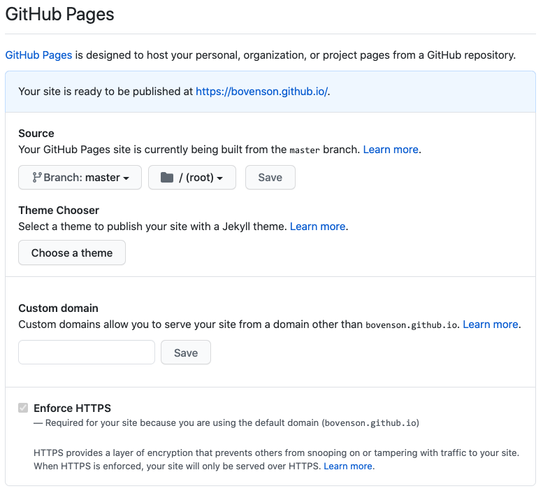

# Webpage

- 创建仓库，仓库名称为 `${user}.github.io`

- 上传静态文件

- 仓库设置中配置 `GitHub Pages`

  

  - 此时，可通过域名 `${user}.github.io` 访问

- 配置自定义域名

  - 在仓库设置中配置 `GitHub Pages` 中的`Custom domain` 中输入自定义域名

    

  - 域名服务商配置CNAME，以阿里云为例

    

