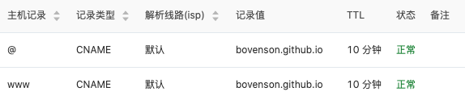

# 访问

[官网](https://hexo.bootcss.com/)

# 安装

```shell
$ npm install hexo-cli -g
```

# 初始化站点

```shell
$ hexo init <folder>
$ cd <folder>
$ npm install
```

# 文件说明

```shell
.
├── _config.yml     # 配置
├── package.json    # 依赖描述
├── scaffolds       # 模板文件夹
├── source          # 资源文件夹，除_posts外，_开头文件夹会被忽略
|   ├── _drafts
|   └── _posts
└── themes          # 主题
```

# Front Matter

| 参数         | 描述                 | 默认值       |
| :----------- | :------------------- | :----------- |
| `layout`     | 布局                 |              |
| `title`      | 标题                 |              |
| `date`       | 建立日期             | 文件建立日期 |
| `updated`    | 更新日期             | 文件更新日期 |
| `comments`   | 开启文章的评论功能   | true         |
| `tags`       | 标签（不适用于分页） |              |
| `categories` | 分类（不适用于分页） |              |
| `permalink`  | 覆盖文章网址         |              |

## 注意

### 分类

Hexo不支持多统计分类，如下分类。

```yaml
categories:
  - Diary
  - Life
```

会使分类`Life`成为`Diary`的子分类，而不是并列分类。

如需为文章添加多个分类，尝试如下方式。

```yaml
categories:
- [Diary, PlayStation]
- [Diary, Games]
- [Life]
```

## 示例

```yml
categories:
- Diary
tags:
- PS3
- Gamesa
```

# 生成静态文件

```shell
$ hexo generate
```

# Github Webpage

- 创建仓库，仓库名称为 `${user}.github.io`

- 上传静态文件至仓库

- 仓库设置中配置 `GitHub Pages`

  

  - 此时，可通过域名 `${user}.github.io` 访问

- 配置自定义域名

  - 在 Hexo `source` 目录下，创建CNAME文件，写入自定义域名 

  - 在仓库设置中配置 `GitHub Pages` 中的`Custom domain` 中输入自定义域名 **[可能无需该操作]**

    

  - 域名服务商配置CNAME，以阿里云为例

    

# 静态资源

```yaml
# _config.yml 中开启/添加如下配置
post_asset_folder: true
marked:
  prependRoot: true
  postAsset: true

# 放置: 在文档相同路径下，创建和项目相同名称文件夹，静态资源放置于此
# 引用示例:  OR 
```

